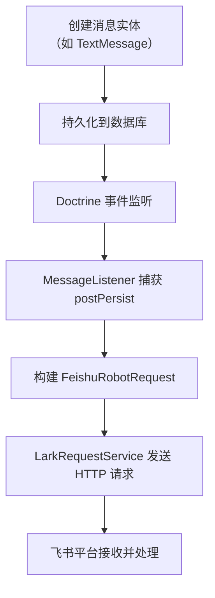

# 工作流程与架构图

本模块的消息发送自动化流程如下：

```mermaid
flowchart TD
    A[创建消息实体<br>（如 TextMessage）] --> B[持久化到数据库]
    B --> C[Doctrine 事件监听]
    C --> D[MessageListener 捕获 postPersist]
    D --> E[构建 FeishuRobotRequest]
    E --> F[LarkRequestService 发送 HTTP 请求]
    F --> G[飞书平台接收并处理]
```

## 说明

- 所有消息类型（文本、图片、卡片、富文本等）均通过持久化实体自动触发发送。
- 事件监听器统一处理消息推送，便于扩展和维护。
- 支持多 webhook 配置，可灵活管理多个机器人。
